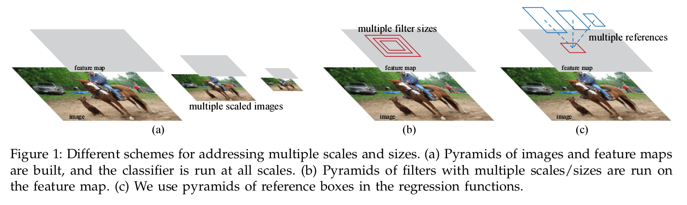
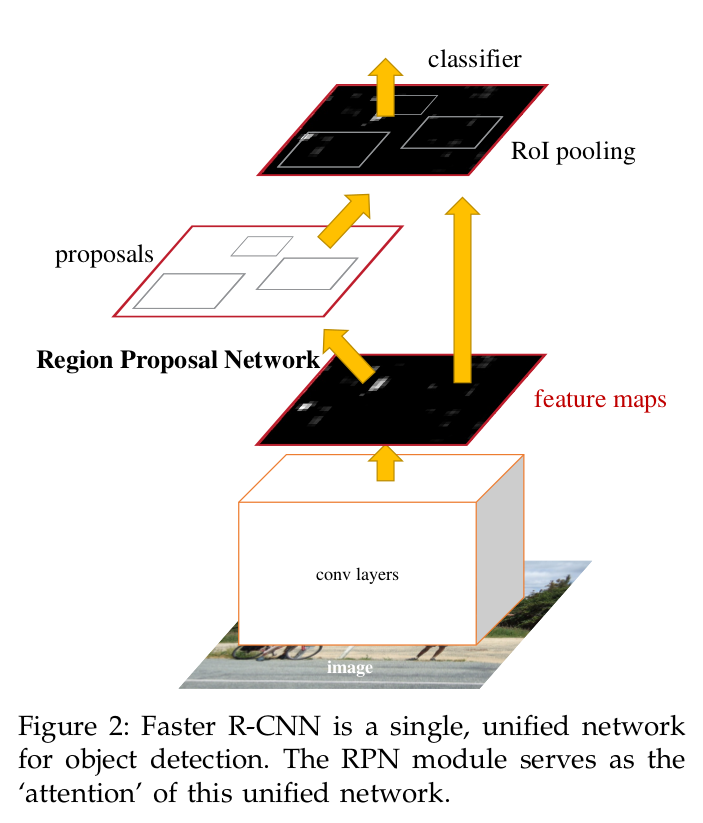
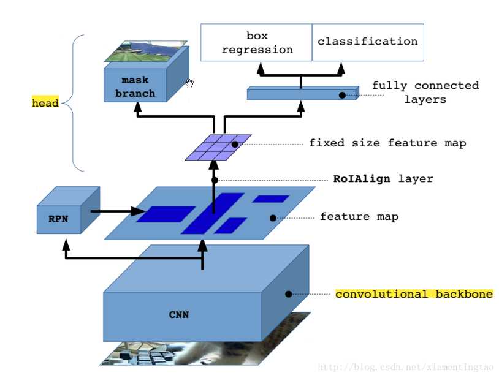
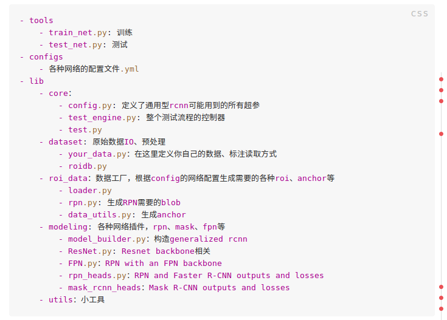

# Faster R-CNN & Mask R-CN
-----------------
## **1.Faster R-CNN**
-----------------
### **1.1论文阅读**
-------------
* *abstract*: 
> In this work, we introduce a Region Proposal Network (RPN) that shares full-image convolutional features with the detection network, thus enabling nearly cost-free region proposals.

> An RPN is a fully convolutional network that simultaneously predicts object bounds and objectness scores at each position. The RPN is trained end-to-end to generate high-quality region proposals, which are used by Fast R-CNN for detection.

>We further merge RPN and Fast R-CNN into a single network by sharing their convolutional features—using the recently popular terminology of neural networks with “attention” mechanisms, the RPN component tells the unified network where to look.

简述主要描述了Faster R-CNN的创新点RPN网络和RPN网路的作用。这篇论文提出了RPN网络（区域推荐网络），它能与检测网络（就是fast RCNN）共享整幅图片的卷积特征。这样就在区域推荐上几乎不用花费时间。

RPN网络是一个FCN（全卷积网络），它能同时的对每块区域预测物体预测框(Object Bounds)和物体类别置信度(objectness scores).RPN网络是端到端的训练，来产生高质量的区域推荐，然后这些区域被后面的Fast R-CNN用来检测。

我们更进一步地将RPN网络和Fast R-CNN整合到同一个单一网络，通过共享它们的卷积特征，使用的方法是在神经网络领域很流行的“atention”机制，让RPN网络告诉统一的网络哪里需要被注意。

* *Introduction*
>Region proposal methods typically rely on inex-
pensive features and economical inference schemes.
Selective Search [4], one of the most popular meth-
ods, greedily merges superpixels based on engineered
low-level features. Yet when compared to efficient
detection networks [2], Selective Search is an order of
magnitude slower, at 2 seconds per image in a CPU
implementation. EdgeBoxes [6] currently provides the
best tradeoff between proposal quality and speed,
at 0.2 seconds per image. Nevertheless, the region
proposal step still consumes as much running time
as the detection network.

分析现有目标检测速度较慢的原因，主要是因为区域提议上面花费大量时间。相比较高效的监测网络，区域提议方法像selective search由于在CPU上面运行，需要花费大量时间（每张图片花费2S），而检测网络在GPU上运行只需0.2S每张图片。

>In this paper, we show that an algorithmic change—
computing proposals with a deep convolutional neu-
ral network—leads to an elegant and effective solution
where proposal computation is nearly cost-free given
the detection network’s computation. To this end, we
introduce novel Region Proposal Networks (RPNs) that
share convolutional layers with state-of-the-art object
detection networks [1], [2]. By sharing convolutions at
test-time, the marginal cost for computing proposals
is small (e.g., 10ms per image).

为了解决这个问题，我们使用深度全卷积网络来做区域推荐。这样优雅和聪明的方法
计算区域推荐时不会给检测网络带来额外的消耗。在最后，我们使区域推荐网络与最好的检测网络共享卷基层。通过在测试阶段共享卷积层，原先花费很多时间的区域推荐变得很小。(10ms每幅图像)

>Our observation is that the convolutional feature
maps used by region-based detectors, like Fast R-
CNN, can also be used for generating region pro posals. On top of these convolutional features, we
construct an RPN by adding a few additional convolutional layers that simultaneously regress region
bounds and objectness scores at each location on a
regular grid. The RPN is thus a kind of fully convolutional network (FCN) [7] and can be trained end-to-
end specifically for the task for generating detection
proposals.

我们的发现是这样的，卷积层的特征图可以被基于区域的检测器（像Fast R-CNN）使用，那同样也可以被用来生成区域推荐。在这些卷积特征层，我们通过增加一些额外的卷积层来构建RPN网络，这样能够对每个常规的网格，进行区域框回归计算和分类置信度计算。RPN网络是一种FCN网络，能够端到端的训练用来完成区域提议任务。

>RPNs are designed to efficiently predict region pro-
posals with a wide range of scales and aspect ratios. In
contrast to prevalent methods [8], [9], [1], [2] that use pyramids of images (Figure 1, a) or pyramids of filters
(Figure 1, b), we introduce novel “anchor” boxes
that serve as references at multiple scales and aspect
ratios. Our scheme can be thought of as a pyramid
of regression references (Figure 1, c), which avoids
enumerating images or filters of multiple scales or
aspect ratios. This model performs well when trained
and tested using single-scale images and thus benefits
running speed.



RPN网络被设计用来高效的进行区域推荐，通过一系列的尺度和长宽比。不同于前人的一些方法：
使用[图像金字塔]（https://opencv-python-tutroals.readthedocs.io/en/latest/py_tutorials/py_imgproc/py_pyramids/py_pyramids.html "Pyramids of images"){:target="_blank"}
或者使用不同尺寸的卷积核。我们提出了"anchor“框作为多尺度和多尺寸的参考。这个设计可以被看成一种回归参考的金字塔，这样能避免枚举多种尺寸的图片和卷积核。这个模型在训练和测试只使用单一尺度的图片。使得模型表现良好，并且这有利于运行速度。

>To unify RPNs with Fast R-CNN [2] object detection networks, we propose a training scheme that
alternates between fine-tuning for the region proposal
task and then fine-tuning for object detection, while
keeping the proposals fixed. This scheme converges
quickly and produces a unified network with convolutional features that are shared between both tasks. 

为了联合RPN和Fast R-CNN检测网络，我们提出了一种训练策略在Fine-Turning区域推荐网络和Fine-Turning目标检测网络交替进行,同时保持区域推荐固定。这个计划收敛迅速，并且产生了一个共享卷积特征的联合网络。

* ***Related Work***


**Objector Proposal**:传统方法主要基于两种:
* those based on grouping super-pixels (e.g.,
Selective Search [4], CPMC [22], MCG [23])
* and those
based on sliding windows (e.g., objectness in windows
[24], EdgeBoxes [6]).


**Deep Networks for Object Detection**:
参照R-CNN和SPPNeth和Fast RCNN

* ***Faster RCNN***

>Our object detection system, called Faster R-CNN, is
composed of two modules. The first module is a deep
fully convolutional network that proposes regions,
and the second module is the Fast R-CNN detector [2]
that uses the proposed regions. The entire system is a
single, unified network for object detection (Figure 2).
Using the recently popular terminology of neural
networks with ‘attention’ [31] mechanisms, the RPN
module tells the Fast R-CNN module where to look.
In Section 3.1 we introduce the designs and properties
of the network for region proposal. In Section 3.2 we
develop algorithms for training both modules with
features shared.

Faster RCNN由两部分组成：第一部分是深度全卷积网络,用来做区域推荐;第二部分是Fast R-CNNj检测器,使用上面产生的区域推荐。整个Faster R-CNN是一个联合的单一网络.使用最近很流行的”attention“机制，RPN网络告诉Fast RCNN去检测何处。

**RPN 网络**
>A Region Proposal Network (RPN) takes an image
(of any size) as input and outputs a set of rectangular
object proposals, each with an objectness score. 3 We
model this process with a fully convolutional network
[7], which we describe in this section. Because our ulti-
mate goal is to share computation with a Fast R-CNN
object detection network [2], we assume that both nets
share a common set of convolutional layers. In our ex-
periments, we investigate the Zeiler and Fergus model
[32] (ZF), which has 5 shareable convolutional layers
and the Simonyan and Zisserman model [3] (VGG-16),
which has 13 shareable convolutional layers.

RPN网络接受所有尺寸的照片输入，并且输出目标提议和每个目标给出类别置信度。我们设计这个网络
使用FCN网络模型。因为我们设计这个网络的目标是与Fast R-CNN网络来共享计算,我们假设两个网络共享相同的卷积层。在我们的实验中，我们使用ZF网络共享5个卷积层，使用VGG-16共享13个卷基层。

>To generate region proposals, we slide a small
network over the convolutional feature map output
by the last shared convolutional layer. This small
network takes as input an n × n spatial window of
the input convolutional feature map. Each sliding
window is mapped to a lower-dimensional feature
(256-d for ZF and 512-d for VGG, with ReLU [33]
following). This feature is fed into two sibling fully-
connected layers—a box-regression layer (reg) and a
box-classification layer (cls). We use n = 3 in this
paper, noting that the effective receptive field on the
input image is large (171 and 228 pixels for ZF and
VGG, respectively). This mini-network is illustrated
at a single position in Figure 3 (left). Note that be-
cause the mini-network operates in a sliding-window
fashion, the fully-connected layers are shared across
all spatial locations. This architecture is naturally im-
plemented with an n × n convolutional layer followed
by two sibling 1 × 1 convolutional layers (for reg and
cls, respectively).


## **2.Mask R-CNN**




## ***3.Detectron代码阅读***

<font color=#FF0000># 代码架构</font>


<font color=#FF0000># 数据准备</font>

相关文件位于/lib/dataset/roidb.py

```python
def combined_roidb_for_training(dataset_names, proposal_files):
    input:dataset_name,proposal_files
    return：filtered_roidb
    function:为数据集加载roidb，并伴随着对象提议。这些roidb数据被准备用于训练，为每个roidb数据需要缓存为元数据用于训练。```

def extend_with_flipped_entries(roidb, dataset):
    input: